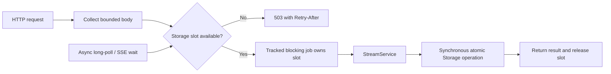

# Bounded execution for synchronous storage

Status: proposal with a runnable example. Production handlers and subscription
workers still call synchronous storage directly. This is the final, separately
reviewable part of the September server audit.

Keep `Storage` and `StreamService` synchronous. Add a private server-owned
execution boundary for their async callers. Each admitted operation gets one
slot and executes on Tokio's blocking pool. When all slots are occupied, reject
new work promptly instead of accumulating waiting requests inside the boundary.
The slot belongs to the operation until it finishes, including any time queued
in Tokio's blocking pool.



The HTTP status and retry header are proposed overload policy. Background
reconciliation would defer its next attempt instead of treating saturation as a
storage failure. Neither policy is implemented by the example.

## See the boundary operate

Run from the workspace root:

```bash
cargo run -p durable-streams-server --example blocking_boundary
```

The [example](../../crates/durable-streams-server/examples/blocking_boundary.rs)
uses a single async worker and two storage slots. Two blocking jobs pause on
explicit channels before appending to real file storage. While they are paused:

1. An async timer runs, demonstrating that the jobs do not occupy the async worker.
2. A third job is rejected because both slots are occupied.
3. Dropping one caller's reply leaves its operation and slot alive.
4. Shutdown rejects new admission and stays pending until both jobs are released.
5. Both appends are visible after shutdown, including the disconnected caller's.

This demonstrates scheduling, admission, and completion semantics. It is not a
throughput benchmark, a complete HTTP adapter, or a proposed public executor API.
The initial setup and final inspection run synchronously for a small standalone
demo; production async paths would also put those storage calls behind the boundary.

## Why capacity follows the job

`spawn_blocking` can queue work after reaching its thread limit. A started
blocking task cannot be forcibly aborted; a runtime shutdown timeout stops
waiting, not the underlying task. The application therefore needs its own
admission bound and completion tracking. See Tokio's
[`spawn_blocking` documentation](https://docs.rs/tokio/latest/tokio/task/fn.spawn_blocking.html).

Use `try_acquire_owned` before spawning. Moving the permit into the closure
bounds accepted storage jobs, including queued jobs, even if the HTTP future is
dropped. A whole logical operation goes into one closure: final append and close
remain one atomic backend operation. Splitting them into separate jobs would
reintroduce the race fixed by the server changes.

The example uses `TaskTracker::spawn_blocking` to track the closure itself.
Closing a tracker does not prevent further registrations. A short admission
mutex covers both registration and closing, so a racing submission cannot be
registered after shutdown observes an empty tracker. Shutdown waits without
holding that mutex. See
[`TaskTracker`](https://docs.rs/tokio-util/latest/tokio_util/task/struct.TaskTracker.html).

An accepted write may finish after its caller disconnects. Losing the response
still leaves the caller uncertain whether it committed. This does not make
plain appends safe to retry; producer deduplication remains the mechanism for
retrying an identified write.

## Production integration to review

`RunningServer` would own the boundary alongside its subscription worker.
Handlers would submit owned request values and a cloned service; no backend
lock guard would cross an await. Subscription persistence and housekeeping need
the same treatment, preserving each complete mutation's existing serialization.
Long-poll/SSE timers and notification waits stay async; only storage snapshots
use a slot. A connection does not hold a slot for its entire lifetime.

Shutdown must stop new HTTP work and new reconciliation, close storage admission,
then wait for admitted operations while Tokio remains alive. Existing listener
and worker drain order needs integration tests, especially for subscription
state writes already in progress. A deadline can report an incomplete drain;
it cannot promise to stop synchronous filesystem calls.

The concurrency limit needs workload measurements: file syncing and same-stream
lock contention can make a larger limit slower. The first implementation should
record active/queued jobs, rejections, operation latency, and failures after a
caller disconnects. Panics and join errors must remain observable even when no
caller receives the result.

This bounds storage jobs, not all server memory. PUT/POST bodies already have a
per-request limit, but collecting many bodies simultaneously can exceed a
process budget. Body admission needs a separate bound or deployment limit;
holding scarce storage slots throughout slow uploads could starve reads and
control operations. Queue fairness and reserved control capacity should be
chosen from measured demand before making configuration promises.
