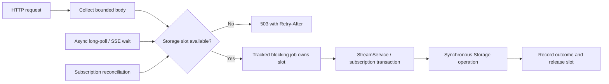

# Bounded execution for synchronous storage

Status: integrated into the production server on 6 September 2026. HTTP storage
paths and subscription persistence share the private execution boundary below.
The original runnable example remains a small ownership demonstration; focused
production tests cover the integration.

This implements the first item from the [upstream comparison][comparison].
It strengthens the existing Axum/Tokio server and its subscription lifecycle.
The [object-storage direction][objects] records future compatibility constraints
without adding that capability to this work.

## Decision and scope

Keep public `Storage` and `StreamService` synchronous. Introduce a private,
server-owned adapter for async callers, backed by Tokio's blocking pool. Each
admitted job owns one capacity slot until its synchronous work finishes,
including time queued in that pool. Reject new work promptly when capacity is
occupied; there is no additional application queue of waiting storage requests.

All router clones, listeners and subscription work belonging to a
`RunningServer` share this boundary. Use it for memory and disk backends alike:
synchronous lock contention can block an async worker even without disk I/O.
This is a bound on admitted jobs, not a process-wide memory or thread limit.



Use the existing Tokio semaphore, `TaskTracker`, cancellation token and tracing
dependencies. `tokio-util`'s `rt` feature is enabled in production as well as
for the example. The serving runtime handle is captured at `Server::start` and
used when spawning jobs. Construction remains usable before Tokio starts.

Tower's [concurrency limit][tower-limit] counts service requests. That remains a
useful deployment control, but the storage bound must follow each actual job:
an SSE response continues reading after its handler returns, and a disconnected
request can leave a write running. The private adapter sits at those call sites.

## Admission and completion ownership

1. Collect PUT/POST bodies asynchronously under the existing per-request byte
   limit. Parse cheap framing before admission. Perform potentially substantial
   synchronous parsing and the validated storage operation inside the admitted
   job where practical. All validation required for mutation remains before the
   mutation, regardless of which side of the boundary performs it.
2. Under a short admission mutex, check that the owner is accepting work and
   cancellation has not been observed, then use `try_acquire_owned`. Register
   the blocking closure with the tracker before releasing that mutex. Closing
   admission uses the same mutex; it cannot race past an unregistered job.
3. Move owned inputs, the permit, completion instrumentation and the storage
   lease into the job. Clone the service handle, not its mutable state. No
   backend or subscription database lock is acquired on the async worker.
4. Run the complete synchronous operation, release its locks and record its
   outcome independently of the response future. Return the result through a
   one-shot reply. Do not expose the blocking task's abort handle to the request.
5. Release capacity on job exit. A dropped reply must neither cancel a queued
   job nor free its slot early. The tracker must cover the closure and its
   cleanup, rather than only an async task awaiting its reply.

Tokio can [queue blocking tasks][spawn-blocking] and cannot abort one that has
started. This design consequently promises completion ownership while the
serving runtime is alive, not survival of runtime teardown or process failure.
The application admission mutex is needed because
[`TaskTracker::close`][tracker] permits subsequent task registrations.

An admitted append may commit after its client disconnects. A missing response
leaves its outcome uncertain; an ordinary append is not thereby safe to retry.
Preserve producer epoch/sequence deduplication for identified retries. Never
automatically replay a job that might already have mutated storage.

Handle a panic at the job boundary independently of the waiting caller. Report
an internal failure and an uncertain outcome, close admission for that owner,
cancel its live waits and worker scheduling, and drain already admitted work.
Do not claim that catching an unwind repairs backend state; reopening requires
the backend's normal recovery. A cleanup guard records abandonment if the
runtime drops a queued closure before it starts. Normal typed backend errors
retain their existing recovery and availability policy.

## Operation boundaries

| Caller | Work submitted together | Work that stays async |
| --- | --- | --- |
| PUT | Validated creation/fork with initial data, returning its mutation outcome | Body collection |
| POST | Complete append/batch/producer operation, including final close | Body collection |
| GET catch-up | Storage read and its owned result | Response delivery |
| Long-poll / SSE start | Register notification receiver before obtaining the initial read | Waiting for notifications, timeout, keepalive and disconnect |
| Long-poll / SSE wake | Read from the last concrete resume offset | Delivery and the next wait |
| HEAD, DELETE, admin list | Complete service operation, including synchronous lock acquisition | HTTP framing |
| Subscription control | Serialized control-state validation, mutation, durable save and cache update | Request collection and webhook destination validation requiring DNS/network |
| Subscription worker | One reconciliation or completion-persistence transaction | Scheduling and webhook HTTP |
| Health/readiness | No storage admission | Entire probe |

Any future housekeeping or server-owned transfer worker that touches synchronous
storage must follow the same rule. Direct synchronous Rust/CLI callers are not
implicitly routed through the server's admission machinery.

One closure is an execution boundary, not a new database transaction. Preserve
the actual [backend lock and transaction rules][architecture], especially
append-and-close, producer state and fork lineage. Placing HEAD and READ in one
closure does not make them a coherent snapshot. Derive returned offsets and
closure from the operation's own result; investigate any remaining second-HEAD
dependency rather than representing it as fixed by offloading.

Registering a notification receiver before reading preserves the existing
protection against a missed wake. Each subsequent read uses the resolved
concrete offset, including when the initial request used `now`. Holding the
receiver or an already materialized response must not retain a storage slot.

## Subscription persistence under load

Move the existing load/clone/validate/save/update sequence wholly into a blocking
job. Its database mutex becomes a synchronous mutex acquired there. Keep the
existing serialization and update the cached database only after persistence
succeeds. A disconnect between save and cache update must not split that
sequence. Network I/O never runs while holding that mutex or a storage permit.

Reconciliation submits one pass at a time. If admission is busy, defer until a
later tick without scanning streams, mutating state, or logging a backend
failure. Do not accumulate missed timer ticks as queued jobs. Preserve the
existing persisted retry deadline before launching each webhook, and the
at-least-once ordering of pull-wake append and its delivered marker. Execution
offloading does not turn those separate durable writes into one transaction.

Keep completed webhook results pending if their persistence job cannot yet be
admitted. A result awaiting persistence still counts against the existing
delivery concurrency limit of 16; running deliveries plus pending results must
stay within that bound. Attempt pending completions before scheduling more
deliveries, and retain the `(subscription, generation)` active marker until the
result is persisted or fenced as stale. Preserve generation/lease checks at the
time the completion transaction actually runs.

Keep the owned completion record until that persistence outcome is known; an
admission attempt must not consume it on a busy rejection. The admitted job can
hold a shared immutable record while the worker retains its retry copy. A failed
save must not start a tight retry loop or silently remove the pending record.

At shutdown, an already admitted persistence job finishes. A completion not yet
admitted may be discarded with the async worker: the previously persisted retry
deadline and generation remain authoritative on restart. The remote webhook
may then be delivered again, as permitted by the existing at-least-once
contract. An HTTP control/callback request receives success only after its own
state save completes.

## Overload and live-read behavior

| Situation | Result |
| --- | --- |
| No slot, or admission closed, before a stream/admin response starts | `503 Service Unavailable`, `Retry-After: 1`, existing safe problem response; HEAD has no body |
| Subscription control admission rejected | `503`, `Retry-After: 1`, subscription `UNAVAILABLE` JSON envelope |
| Background admission rejected | Defer; distinguish capacity pressure from storage failure |
| SSE read admission rejected after headers were sent | End the stream and record the reason; no invented SSE error event or advanced control offset |
| Unexpected job failure | Existing safe internal-error response when headers permit; owner stops admitting work as described above |

An admission rejection occurs before that job's mutation. It must not be
confused with an error from a job whose commit outcome is uncertain. Keep these
as distinct private error cases even where the HTTP status is shared. Map busy
and closed admission through the existing typed unavailable error; do not add
backend details to public problem text.

Long-poll timeout/shutdown handling needs particular care. The previous
[handler][get] could return a reread's new offset with an empty 204 response,
skipping unsent bytes. The integration corrects that transition. On a normal timeout, a reread must
use the same data-versus-empty response logic as a wake, or report admission
failure. On shutdown, return an empty response only from the previously obtained
empty snapshot and its unchanged concrete offset; do not require fresh storage
admission after closing the boundary. Do not assert newly discovered closure
without delivering the data through its final offset.

Validate these transitions against the [pinned protocol][protocol] and existing
shutdown tests. Cache policy and cursor generation remain separate follow-up
work; this integration must preserve response framing and resumability while
changing scheduling and overload behavior.

## Ownership and shutdown

`RunningServer` owns one boundary alongside the subscription worker. Routers
retain that owner as today. Jobs retain a separate storage lease and the service
state they need, so dropping the last router cannot release exclusive ownership
while an accepted write still runs. Jobs must not retain the entire server owner
in a cycle that prevents its drop-triggered cancellation. The lease continues
to protect one storage `Arc` within a process; it is not a distributed fence or
a lock protecting independently constructed wrappers over the same files.

The shutdown sequence is:

1. The embedding application stops listener admission and clears its readiness
   flag. The binary performs those steps for its own listener.
2. Close storage admission under the registration mutex, then cancel live waits
   and new reconciliation. Every submission also checks the supplied
   cancellation source so externally initiated shutdown is respected before
   the explicit drain call.
3. Stop/await the async subscription worker and its delivery tasks. Admitted
   storage closures continue independently if their reply futures disappear.
4. Await the closed storage tracker even if the worker join returned an error.
   Drain HTTP listeners and storage while the serving Tokio runtime remains
   alive. Listener errors must also take this cleanup path.

The HTTP drain and storage drain can overlap; neither may abandon accepted
storage jobs. `RunningServer::shutdown` remains idempotent and safe for concurrent
callers. Cancelling one shutdown future must leave worker handles and the
tracker available to a later caller. Return a worker join error only after
storage has drained. Preserve the existing method signature: successful drain
means work has terminated, not that every operation succeeded. Operation errors
and panic diagnostics are recorded independently.

Dropping the final owner closes admission and signals cancellation as a
backstop; Rust `Drop` cannot await completion. Embedders use explicit shutdown
for the drain guarantee. A caller-owned deadline can report incomplete drain,
but cannot stop filesystem calls or justify claiming they finished. The binary's
HTTP grace period must not be described as a storage cancellation deadline.

## Configuration, observability and compatibility

Add `limits.max_storage_jobs: usize`, with environment override
`DS_LIMITS__MAX_STORAGE_JOBS`, through the existing resolved config, TOML patch,
environment precedence and effective-config output. Use an initial default of
64 and validate `1..=tokio::sync::Semaphore::MAX_PERMITS` in the validation path
used by `Server::new`. This is an engineering starting point, not a measured
optimum; mixed-workload measurements can tune the default without changing the
meaning of the setting. Reject zero and out-of-range input with a typed config
error before constructing the semaphore.

The limit counts queued plus running local jobs across all server-owned callers.
There is no memory-backend bypass, unbounded mode, separate per-router budget or
public executor type. Start with a shared pool and no reserved control slots;
there is no fairness or maximum-latency guarantee under sustained saturation.
Measure control latency and deferred work before introducing reservations.

Record admitted and running counts, admission rejections by reason, queue wait,
operation duration, operation outcome, and caller disconnection. Derive queued
work from admitted versus running accounting; retain guards through unwind and
queued-job cancellation. Carry the request span into the blocking closure.
Record expected domain rejections separately from backend errors, and expose
failures even without a receiving caller. Use bounded operation/backend labels;
stream paths belong in diagnostic spans, not metric dimensions. The existing
tracing integration is the first delivery mechanism, without a new mandatory
metrics service.

`LimitsConfig` and configuration errors already support additive extension.
Keep existing `Storage` implementations, `StreamService` methods,
`Server::new/start`, router composition and `RunningServer::streams()` usable.
Document that direct synchronous callers choose their own async execution
policy and are outside the server's capacity/drain accounting. Update the API
snapshot for the configuration addition and the lifecycle rustdoc/migration
guide for the stronger drain contract. No storage format change is needed.

Body collection and response buffers remain separately owned. Many individually
bounded uploads or backlog reads can still consume substantial aggregate memory.
Use deployment admission for that pressure now; subsequent bounded reads and
body budgets are distinct work. Do not hold scarce storage slots throughout
uploads or slow response delivery.

## Integration and acceptance

| Area | Required change and evidence |
| --- | --- |
| Private execution module and `router.rs` | Atomic admission/close, runtime binding, lease retention, detached completion and drain |
| `handlers/{put,post,get,head,delete,list}.rs` | Move every synchronous storage/lock path into admitted work; keep probes responsive |
| `subscriptions/{mod,api,worker}.rs` | Preserve serialized durable state changes, bounded pending completions and async network delivery |
| `main.rs` | Await cleanup after listener success and failure; keep runtime alive for storage drain |
| Config, rustdoc and migration guide | Validate/document the shared limit and synchronous embedding boundary; review public API diff |

Production acceptance requires deterministic, channel-controlled backend tests:

- With one Tokio async worker, pause a real storage operation; a timer and health
  probe still respond. A second operation at capacity returns the correct 503
  envelope/header and leaves storage untouched.
- Limit the runtime to one blocking thread and queue an additional admitted
  job. Its slot remains occupied before it starts and after its caller drops.
- Pause an admitted final append/close, disconnect its caller, and start two
  shutdown waits. Both wait for completion; the committed data and closure are
  recoverable after reopening. Dropping routers cannot prematurely release the
  owner lease.
- Race submission against close repeatedly. Every job is either rejected
  before mutation or included in the drain. Cancelling and retrying a shutdown
  wait does not lose its completion handles; a worker error cannot skip drain.
- Saturate storage while an idle long-poll/SSE connection waits. Idle connections
  consume no slot; a wake re-enters admission. Shutdown, timeout, lagged
  notifications and failed rereads never advance past undelivered data.
- Pause subscription persistence, disconnect its caller, then verify durable
  state and its cached view agree. Under overload, reconciliation defers and
  completed webhook results remain bounded and retain generation fencing.
- Inject a job error and a panic after dropping the reply. Both are observable;
  panic closes admission, guards release capacity, and drain completes. Test
  config defaults, TOML/environment precedence and invalid capacity separately.

Run the applicable [contributor checks][contributing], server API snapshot and
server conformance across the supported backends for the integration. Focused evidence lives in the [execution tests][execution-tests],
[lifecycle tests][lifecycle-tests], [HTTP/file tests][http-tests], and
[subscription completion test][subscription-tests]. The standalone example alone
does not establish these production guarantees.

The [integration validation record](../standards.md#2026-09-06-bounded-storage-execution-integration)
records the passing workspace checks, reviewed API snapshot and all four
supported backends' conformance runs.

## Runnable evidence

Run from the workspace root:

```bash
cargo run -p durable-streams-server --example blocking_boundary
```

The [example][example] uses one async worker and two slots. Two blocking jobs
pause before real file-backed appends. It verifies that an async timer runs,
a third job is rejected, dropping a reply keeps its job and slot alive, and
shutdown waits for both appends. Both writes are visible after the drain.

The example covers those ownership rules only. It has no HTTP integration,
subscription work, production configuration, detached failure instrumentation
or object publication. Its setup and final inspection are synchronous and its
successful drain does not constitute crash-durability testing.

[comparison]: ../reviews/2026-09-06-upstream-rust-comparison.md
[objects]: object-storage-direction.md
[architecture]: ../architecture.md#storage-read-boundaries
[get]: ../../crates/durable-streams-server/src/handlers/get.rs
[protocol]: https://github.com/durable-streams/durable-streams/blob/a172acc389351cb3db6deb5cd60e3dec11e7ff39/PROTOCOL.md
[contributing]: ../../CONTRIBUTING.md
[example]: ../../crates/durable-streams-server/examples/blocking_boundary.rs
[spawn-blocking]: https://docs.rs/tokio/latest/tokio/task/fn.spawn_blocking.html
[tracker]: https://docs.rs/tokio-util/latest/tokio_util/task/struct.TaskTracker.html
[tower-limit]: https://docs.rs/tower/latest/tower/limit/concurrency/struct.ConcurrencyLimitLayer.html

[execution-tests]: ../../crates/durable-streams-server/src/execution/tests.rs
[lifecycle-tests]: ../../crates/durable-streams-server/src/router/tests.rs
[http-tests]: ../../crates/durable-streams-server/tests/storage_execution.rs
[subscription-tests]: ../../crates/durable-streams-server/src/subscriptions/worker/tests.rs
