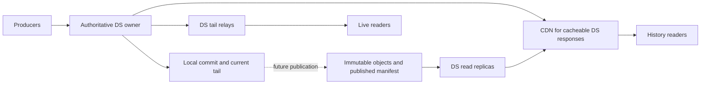

# Optional object storage and read fan-out

Status: future direction recorded 6 September 2026, following the
[upstream comparison][comparison]. No object backend, replication, new Cargo
feature or distributed ownership mechanism is implemented by this document.
The [bounded local execution boundary][execution] is now integrated; object
publication remains a future capability.

The aim is a coherent end-to-end Durable Streams implementation, with idiomatic
Rust embedding, Axum/Tokio integration, subscriptions and deployment support.
Upstream deliberately covers a narrower product surface. Its mechanisms can
inform this direction without making reduced scope our objective.

## Direction to preserve

Keep one authoritative owner for writes to a stream and its mutable control
state. Allow many readers to obtain immutable committed history through a CDN
and, potentially, optional object storage. Read relays can follow the owner's
DS endpoint and distribute its live tail using DS offsets and reconnects;
this does not inherently require Redis or a separately operated database.

This increases read capacity. Scaling writes across independent stream groups
would be a separate ownership/routing design. A shared filesystem does not
establish that ownership: our backends maintain process-local state and
notifications, and the server lease identifies an `Arc` within one process.
The current redb/file backends do not become multi-owner backends when their
paths resolve to shared storage.

Object bytes and a CDN do not themselves implement DS. The serving path still
needs message framing, offsets, expiry, forks, closure, authentication and
reconnect semantics. A replica without the unpublished tail must route that
read to the owner, or report temporary unavailability when it cannot satisfy
it. Its local published boundary must not masquerade as the authoritative tail
or cause a false `upToDate` / `Stream-Closed` assertion.

Keep subscription claims, producer deduplication, stream lifecycle and webhook
scheduling at the authoritative owner. Relays distribute data; starting the
same control worker on each relay would duplicate ownership. Initially keep a
fork family together; moving ownership or reading lineage across owners needs
an explicit design before enabling write sharding. Automatic failover requires
fencing and a recovery policy. A conditional manifest write alone does not fence
an old owner that can still acknowledge writes to its local log.

## Learn from their publication ordering

Upstream separates an async [blob interface][upstream-blob] from its local
storage engine. Its [offload operation][upstream-tier] uploads a sealed chunk,
checks the remote size, persists the changed placement and then removes the
local chunk. The useful lessons are immutable transfer units and an explicit
publication order. Its locally persisted placement metadata is not evidence of
a shared multi-owner manifest or distributed write protocol.

For our possible distribution path, retain the following design constraints:

1. **Commit locally.** A successful append retains the selected local backend's
   durability contract. Keep enough durable information to rediscover publication
   work after a crash: either derive it from committed immutable history or
   persist an intent in the same transaction as the relevant state. An in-memory
   upload queue or a separately written marker is not that guarantee.
2. **Produce stable objects.** Capture a bounded range from a protected stream
   generation, with message boundaries, logical offsets, format version and an
   integrity check. Upload under an immutable generation/range or content key.
   Do not upload a live redb file or assume a cloned descriptor protects our
   append log from in-place replacement and rollback.
3. **Publish discoverability.** After required object writes succeed and their
   integrity is established, advance the manifest conditionally from the
   expected generation/version. Publish only a contiguous range with all data
   needed to interpret it. Readers discover history through that manifest,
   rather than inferring completeness from bucket listing.
4. **Recover and reclaim.** Retry uploads/publication idempotently. An object
   uploaded before a crash may be an orphan; a manifest committed before the
   local acknowledgement may already be authoritative remotely. Re-read and
   reconcile rather than blindly advancing or overwriting it. Reclamation must
   respect retained fork ancestry, active readers, manifests and deletion state.

These are requirements for a future design, not a new storage format. In
particular, a durable publication intent might need a backend-specific optional
capability. Enable publication only for backends that can meet the contract;
do not add mandatory publication methods to every existing `Storage` implementor.

Amazon S3 provides [strong per-object read-after-write consistency][s3-consistency]
and [conditional writes][s3-conditional]. That removes one source of stale
origin reads, but does not make our local commit, several object uploads and a
manifest update one transaction. CDN caches and replica progress can still lag.
Other S3-compatible providers need their actual conditional-write and consistency
guarantees checked; endpoint compatibility alone does not establish them.

Keep three positions distinct in the internal design:

| Position | Meaning |
| --- | --- |
| Local committed offset | Data accepted under the chosen backend's commit contract |
| Published offset | Contiguous data and interpretation metadata discoverable remotely |
| Reader resume offset | Position through which that response actually delivered data |

For a given generation, published data cannot exceed committed data. A reader
served only from objects cannot advance beyond the published range; a reader
using the owner can advance further. These are conceptual positions, not new
wire offset formats or proposed public struct fields.

The default direction is local acknowledgement followed by asynchronous
publication. It therefore does **not** promise survival of the sole local disk's
loss before publication. A future remotely durable acknowledgement mode would
need explicit configuration and guarantees for producer/control metadata as
well as payloads. Enabling a Cargo feature must not silently change the meaning
of a successful append.

Publication backlog needs byte and age accounting, durable retry, staging-space
limits and an explicit full-disk policy. Network transfer must have its own
concurrency and byte budgets. Acquire a local storage slot for snapshot/staging
or metadata commits, release it before awaiting network I/O, then re-enter local
admission as needed. If that admission is busy, durable pending work remains
retryable. Do not park all local permits behind a slow object endpoint.

## API decisions that prevent predictable breaks

| Existing surface | Constraint for current work and future extension |
| --- | --- |
| Synchronous `Storage` and `StreamService` | Preserve local callers. Keep the async execution adapter private; it must not become a public universal abstraction requiring remote I/O to block a thread. Add remote behavior through separately designed async composition when needed. |
| `Server::new/start`, `RunningServer` and composable routers | Preserve the local constructor and shared owner. Future publication gets an additive configuration/builder path and owned workers. A remote-only replica may need a separate serving API; do not reinterpret `streams()` as a remote synchronous client. |
| Exhaustive `StorageMode` enum | Compose publication with the chosen local backend. Adding `ObjectStorage` to this enum, or making it non-exhaustive, can break downstream exhaustive matches. A feature does not remove that concern. |
| Non-exhaustive resolved configuration structs | Add optional distribution configuration when implemented, with typed validation. Omitted configuration preserves local behavior. Do not add placeholder fields, credentials or unused settings now. |
| `ReadResult` with owned `Vec<Bytes>` | Preserve this result for its existing callers. A bounded/lazy read path needs a distinct internal result or an additive API; changing the existing field to a file handle or stream would break callers. |
| Read snapshots and offsets | Represent stable logical ranges and generation lifetime privately. Avoid public raw file descriptors, redb guards, bucket keys or cloud SDK types. Preserve wire offsets as opaque client tokens. |
| Tokio broadcast notification receiver | Keep it as a local wake mechanism. A future relay can translate DS progress into local wakes; the receiver must not be documented as a distributed notification bus. |
| Shutdown and errors | Own and observe publication/relay workers as part of server lifecycle. Define whether shutdown drains network publication or leaves durable pending work. Preserve typed distinctions between unavailable remote data and uncertain commit outcomes. |

No public trait change is needed merely to integrate bounded local execution.
Future bounded reads still need their own compatibility review: adding a default
method that first reads the entire backlog would preserve compilation without
providing a bounded-memory guarantee. A backend capability or fallback must be
honest about the guarantee it actually offers.

Use an optional Cargo feature, tentatively `object-storage`, to gate the object
client dependencies and adapters when real implementation exists. Runtime
configuration selects whether and how a compiled capability runs. The default
build remains locally usable, and enabling all features must preserve existing
constructors, trait implementations and local behavior. Cargo features are
[additive and unified across dependants][cargo-features]; they cannot safely
hide changed required trait methods or mutually exclusive sync/async signatures.

The Rust [`object_store` crate][object-store] is a candidate for async object
operations, ranged reads and conditional writes. Keep any eventual provider
adapter behind our boundary; select its version and check MSRV/provider support
when implementing. Axum/Tokio supplies HTTP serving and async tasks, while the
publication and ownership protocol remains our responsibility. No dependency
or empty feature is added just to reserve a name.

## Coherence work before advertising fan-out

Our existing [security middleware][security] forces ordinary GET responses to
`no-store`. The [GET handler][get] currently discards the incoming cursor, and
the [cursor generator][cursor] uses a process-local counter. Review them together
against the cache and cursor rules in the [pinned protocol][protocol] before
relying on CDN request collapsing. Passing the current conformance suite does
not establish that a multi-origin CDN deployment behaves correctly.

The follow-up needs concrete cache tests for immutable catch-up ranges, tail
responses, authentication-aware keys, delete/recreate and replacement
generations, TTL refresh/expiry and retained forks. Explicitly distinguish a
replica's published position from the owner's current tail. Avoid allowing a
stale cached manifest or reset offset to serve an earlier stream incarnation.

The implementation order remains: bounded local execution; durability and
bounded-read improvements with mixed-workload measurement; cache/cursor and
end-to-end deployment coherence; then evaluate relays or optional object
publication against an actual workload. Object storage is a direction to allow,
not a prerequisite for completing the local server or a commitment to automatic
storage tiering.

[comparison]: ../reviews/2026-09-06-upstream-rust-comparison.md
[execution]: blocking-execution-boundary.md
[upstream-blob]: https://github.com/electric-sql/electric/blob/88793e76595d69be300731b9b25c58538923a53b/packages/durable-streams-rust/src/blobstore.rs
[upstream-tier]: https://github.com/electric-sql/electric/blob/88793e76595d69be300731b9b25c58538923a53b/packages/durable-streams-rust/src/tier.rs
[s3-consistency]: https://docs.aws.amazon.com/AmazonS3/latest/userguide/Welcome.html#ConsistencyModel
[s3-conditional]: https://docs.aws.amazon.com/AmazonS3/latest/userguide/conditional-writes.html
[cargo-features]: https://doc.rust-lang.org/cargo/reference/features.html#feature-unification
[object-store]: https://docs.rs/object_store/latest/object_store/
[security]: ../../crates/durable-streams-server/src/middleware/security.rs
[get]: ../../crates/durable-streams-server/src/handlers/get.rs
[cursor]: ../../crates/durable-streams-server/src/protocol/cursor.rs
[protocol]: https://github.com/durable-streams/durable-streams/blob/a172acc389351cb3db6deb5cd60e3dec11e7ff39/PROTOCOL.md
